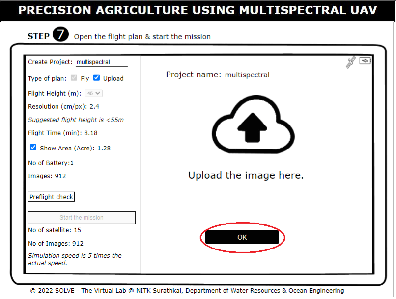
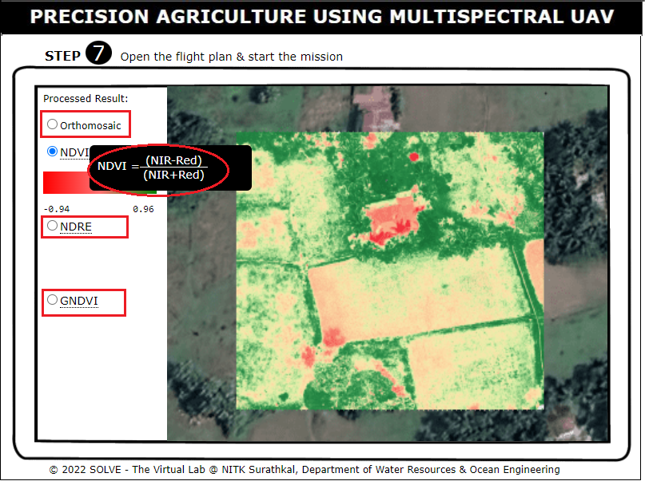

1. Note the objective, apparatus and description and click on Next.

2. Click on the antennas to unfold them.
    

3. Unfold the device holder, and click on the device to place it on the holder.
    

4. Click on the Cable to connect the device to the transmitter. Click on Next.
   

5. Click on the drone box and remove the drone carefully, click on the gimbal cover to remove it from the camera. Click on the sensor to see the name of each sensor. Click on the propellor to fix them.
   

6. Click on the fully charged Battery to insert it into the slot in the drone. Click on Next.
   

7. Click on the Landing Pad and on the drone to place the drone on the landing pad. As the drone flies and starts capturing images, the Multispectral camera will capture 6 images in every scene. Click on Next.
   

8. Click on the Power button of the transmitter to start the mission planning. 
   

9. Open the Flight planning Mission, Enter the name of the project. Click on Fly and select the flight height from the drop-down menu. Note down the corresponding resolution, and flight time. Click on Show Area to note down the area to be surveyed.
   

10. Note down the Number of Batteries and the number of images to be captured. Click on Preflight Check and tick all the entities. Click on Start mission to fly the drone.
   

11. Note the image captures as the drone moves Click on Upload to upload the captured images.
   

12. Click on OK to upload the images captured.
   

13. As the upload is complete click on Next to see the processed map.
   

14. To see the Orthomosaic map, NDVI, NDRE, and GNDVI map click as shown. Hover to see the formula of the VI. Click on Next.
   

15. Refer to the inference of the map created.
   