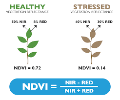

### Theory :

Multispectral data and its use in vegetation analysis is not a new thing. Agronomists, farmers, and forestry professionals as well as environmental researchers have depended on this information for decades, thanks to satellite imagery. However, satellites introduce their limits. Namely: lower resolutions, gated access, and interruptions with cloud cover. Drones with multispectral cameras, however, address all of these limits. The Multispectral camera system contains six cameras including an RGB camera and a multispectral camera array containing five cameras for multispectral imaging, covering the following bands: Blue (B): 450 nm ± 16 nm; Green (G): 560 nm ± 16 nm; Red (R): 650 nm ± 16 nm; Red edge (RE): 730 nm ± 16 nm; Near-infrared (NIR): 840 nm ± 26 nm. The spectral sunlight sensor on top of the aircraft detects solar irradiance in real-time for image compensation, maximizing the accuracy of collected multispectral data.

Vegetation Indices are constructed from reflectance measurements in two or more wavelengths to analyze specific characteristics of vegetation, such as total leaf area and water content. The Normalized Difference Vegetation Index (NDVI) is an index of plant “greenness” or photosynthetic activity and is one of the most commonly used vegetation indices. Vegetation indices are based on the observation that different surfaces reflect different types of light differently.

NDVI =(NIR — Red)/(NIR + Red)

<figcaption>Source: <a href="https://encrypted-tbn0.gstatic.com/images?q=tbn:ANd9GcRWVTIRPw__peusZGzVnrwhgN6Wo2y-6Egaaw&s">https://encrypted-tbn0.gstatic.com/images?q=tbn:ANd9GcRWVTIRPw__peusZGzVnrwhgN6Wo2y-6Egaaw&s</a></figcaption>

Spectral reflectance refers to the proportion of incident light reflected by a surface at different wavelengths. Vegetation exhibits unique spectral reflectance characteristics, with strong absorption in the blue and red bands due to chlorophyll, high reflectance in the near-infrared (NIR) due to leaf structure, and moderate absorption in the shortwave infrared (SWIR) due to water content. Spectral reflectance curves (SR curves) visually depict these variations, enabling vegetation health assessment. NDVI (Normalized Difference Vegetation Index) leverages the contrast between NIR reflectance and red absorption to quantify vegetation vigor and biomass.

<figcaption>Source: <a href="https://www.researchgate.net/profile/Anamaria-Roman-2/publication/315797574/figure/fig4/AS:610521724235776@1522571130104/The-spectral-reflectance-curve-of-vegetation-The-major-absorption-and-reflectance.png">https://www.researchgate.net/profile/Anamaria-Roman-2/publication/315797574/figure/fig4/AS:610521724235776@1522571130104/The-spectral-reflectance-curve-of-vegetation-The-major-absorption-and-reflectance.png</a></figcaption>

Various factors can affect NDVI values like:

1. Plant photosynthetic activity
2. Total plant cover
3. Biomass
4. Plant and soil moisture
5. Plant stress.

The normalized difference red edge index (NDRE) is a metric that can be used to analyze whether images obtained from multi-spectral image sensors contain healthy vegetation or not. It is similar to Normalized Difference Vegetation Index (NDVI) but uses the ratio of NearInfrared and the edge of Red.

NDRE =(NIR — RedEdge)/(NIR + RedEdge)

This allows the grower to determine all the different variables for crop management. Understanding the levels of chlorophyll can provide the farmer with the ability to monitor photosynthesis activity.

Data from multispectral imaging has the following benefits:

1. Identify pests, diseases, and weeds. Optimize pesticide usage and crop sprays through early detection.
2. Provide data on soil fertility and refine fertilization by detecting nutrient deficiencies.
3. Help with land management and whether to take agricultural land in or out of production or rotate crops etc.
4. Count plants and determine population or spacing issues.
5. Estimate crop yield.
6. Measure irrigation. Control crop irrigation by identifying areas where water stress is suspected. Then, make improvements to land
   areas such as installing drainage systems and waterways based on the multispectral data.
7. View damage to crops from farm machinery and make necessary repairs or replace problematic machinery.
8. Survey fencing and farm buildings.

